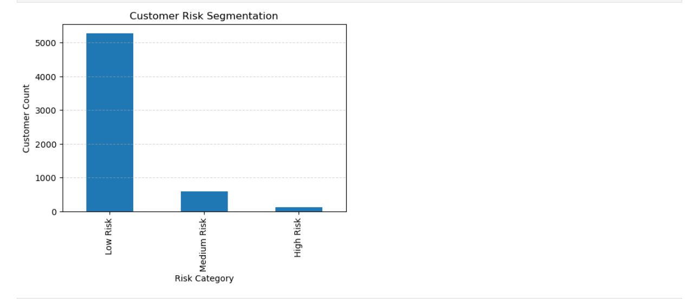

# Credit Risk Modeling & Customer Default Prediction

Machine Learning project for predicting customer credit default risk using Python, Scikit-Learn and XGBoost.

## Project Overview
This project analyzes customer credit information and predicts the probability of default using machine learning techniques.

## Technologies Used
- Python
- Pandas
- NumPy
- Matplotlib
- Scikit-Learn
- XGBoost

## Project Workflow
1. Data Cleaning
2. Exploratory Data Analysis
3. Feature Engineering
4. Feature Scaling
5. Model Training
6. Hyperparameter Tuning
7. Risk Segmentation

## Model Used
- XGBoost Classifier

## Customer Risk Segmentation

## Key Insights
- Payment history is the strongest indicator of default risk.
- Most customers fall into the Low-Risk category.
- High-Risk customers require stricter credit evaluation.

## Author
Nithish Kumar
